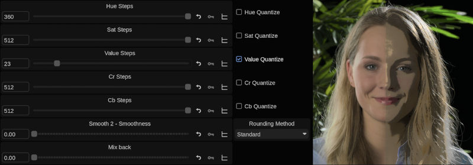

# Channel Quantizer

Quantize in Hue, Saturation, Value, and/or Chroma

This shader reduces the number of steps, introducing posterization in several channels.
For all channels except Value watch the Vectorscope / Chromaticity view to understand the behaviour.

## Installation

Unzip and place files into the */vol/.support/shaders* folder which is the same as
- **Linux:** /usr/fl/shaders
- **MacOS:** /Library/Application Support/FilmLight/shaders