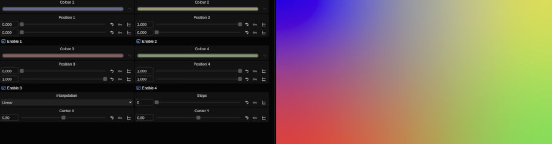

# Colour Gradient

Generate a gradient between two, three, or four colors

## Installation

To install the shader, unzip and place files into the */vol/.support/shaders* folder which is the same as
- **Linux:** /usr/fl/shaders
- **MacOS:** /Library/Application Support/FilmLight/shaders