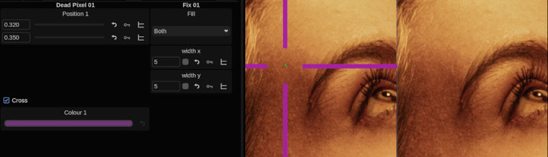

# Dead Pixel Fixer

Repair a stuck or dead pixel using surrounding pixels.

Manually identify a pixel or group of pixels on the image to be filled by pulling from surrounding pixels.

## Installation

Unzip and place files into the */vol/.support/shaders* folder which is the same as
- **Linux:** /usr/fl/shaders
- **MacOS:** /Library/Application Support/FilmLight/shaders