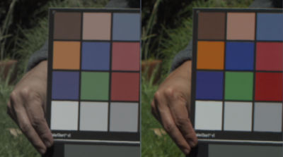

# HSV Dark Sat

Apply Gain/Gamma to Saturation in HSV.

This saturates and darkens colors, an effect sometimes called dark saturation or subtractive saturation.

## Installation

Unzip and place files into the */vol/.support/shaders* folder which is the same as
- **Linux:** /usr/fl/shaders
- **MacOS:** /Library/Application Support/FilmLight/shaders